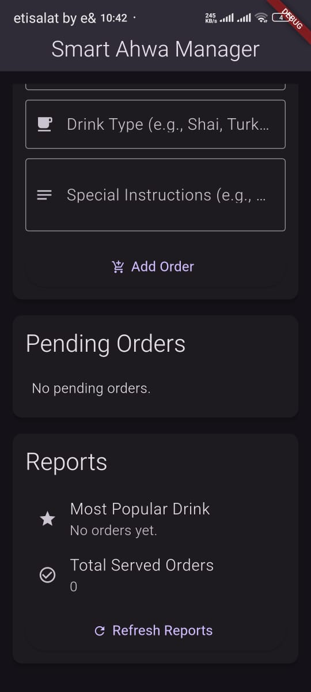
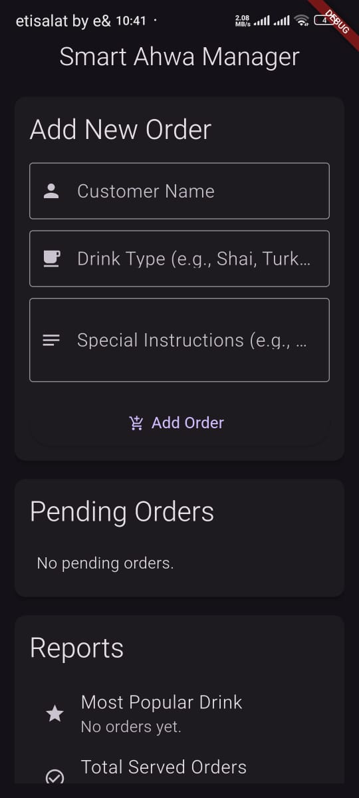

# ☕ Smart Ahwa Manager App

### 📱 Overview
**Smart Ahwa Manager** is a simple Flutter application built to simulate how an Egyptian café (Ahwa) can manage its customer orders efficiently.  
The app helps staff take new orders, track their status (pending or completed), and view simple reports showing the most popular drink and total served orders.

This project focuses on **clean design**, **separation of concerns**, and **maintainable code structure** — making it a perfect small-scale example for learning how to apply professional software engineering concepts using Flutter and Dart.

---

## 🚀 Features
- Add new customer orders with drink type and special notes.  
- View all pending orders in a clear, simple list.  
- Mark orders as completed once served.  
- Generate small business insights such as:
  - The most popular drink.
  - The total number of completed orders.

---

## 🧠 Object-Oriented Design & SOLID Principles

This project — **Smart Ahwa Manager App** — was built in **Flutter** as a small practical example to demonstrate the use of **Object-Oriented Programming (OOP)** and the **SOLID principles** in real-world app design.

### 🧩 Object-Oriented Concepts
The app is structured using the core OOP concepts:
- **Encapsulation:** Each class manages its own data and behavior (e.g., `Order`, `Drink`, `ReportService`) ensuring data integrity and reducing external interference.
- **Inheritance:** Common functionality and shared fields are defined in abstract base classes (e.g., `DrinkBase`), which are extended by specific drink types like `Shai`, `TurkishCoffee`, and `HibiscusTea`.
- **Polymorphism:** Different drink objects can be handled through a common interface (`IDrink`), allowing flexible and dynamic handling of different drink types in the same system.
- **Abstraction:** Unnecessary details are hidden behind abstract classes and interfaces, making the codebase more readable, reusable, and maintainable.

---

### ⚙️ SOLID Principles in Action
This project follows several SOLID design principles to ensure modularity and scalability:

- **S — Single Responsibility Principle (SRP):**  
  Each class has one clear purpose — for example, `OrderManager` handles order operations, `ReportService` generates reports, and `Drink` classes focus only on drink data.

- **O — Open/Closed Principle (OCP):**  
  The system is open for extension but closed for modification. New drink types can be added by creating new subclasses without changing existing code.

- **L — Liskov Substitution Principle (LSP):**  
  Any subclass (like `Shai` or `TurkishCoffee`) can replace its parent type (`DrinkBase`) without breaking the system’s behavior.

- **I — Interface Segregation Principle (ISP):**  
  The app uses focused interfaces like `IDrink` so that classes only implement methods they actually need, avoiding “fat” interfaces that force unnecessary code.

- **D — Dependency Inversion Principle (DIP):**  
  High-level classes like `OrderManager` and `ReportService` depend on abstractions (`IOrderRepository`, `IReportService`) instead of concrete implementations.  
  This makes the system more flexible and easier to test or refactor.

---

### 🧱 Summary
The **Smart Ahwa Manager App** demonstrates how applying **OOP** and **SOLID principles** results in clean, maintainable, and extendable Flutter code — even in small projects.  
By separating concerns and designing around abstractions rather than implementations, the system becomes easier to test, scale, and evolve.

---

### 🧑‍💻 Tech Stack
- **Language:** Dart  
- **Framework:** Flutter  
- **Architecture:** Clean Architecture (Layered design)  
- **Data Handling:** In-memory repository  

---

### 📂 Project Structure
lib/
│
├── core/
│ ├── interfaces/ # Interfaces (contracts)
│ ├── models/ # Core data models (Customer, Order)
│ └── services/ # Business logic (OrderManager, ReportService)
│
├── data/
│ ├── drinks/ # Concrete drink classes (Shai, TurkishCoffee, HibiscusTea)
│ └── repositories/ # InMemoryOrderRepository
│
└── main.dart # UI Layer (basic interface for testing)

---

### 🧩 Purpose of This Project
This project was developed as a **learning tool** to help junior Flutter developers understand how to apply:
- OOP design patterns  
- SOLID principles  
- Clean Architecture layering  

It serves as a foundation for building larger, scalable, and professional Flutter applications.

